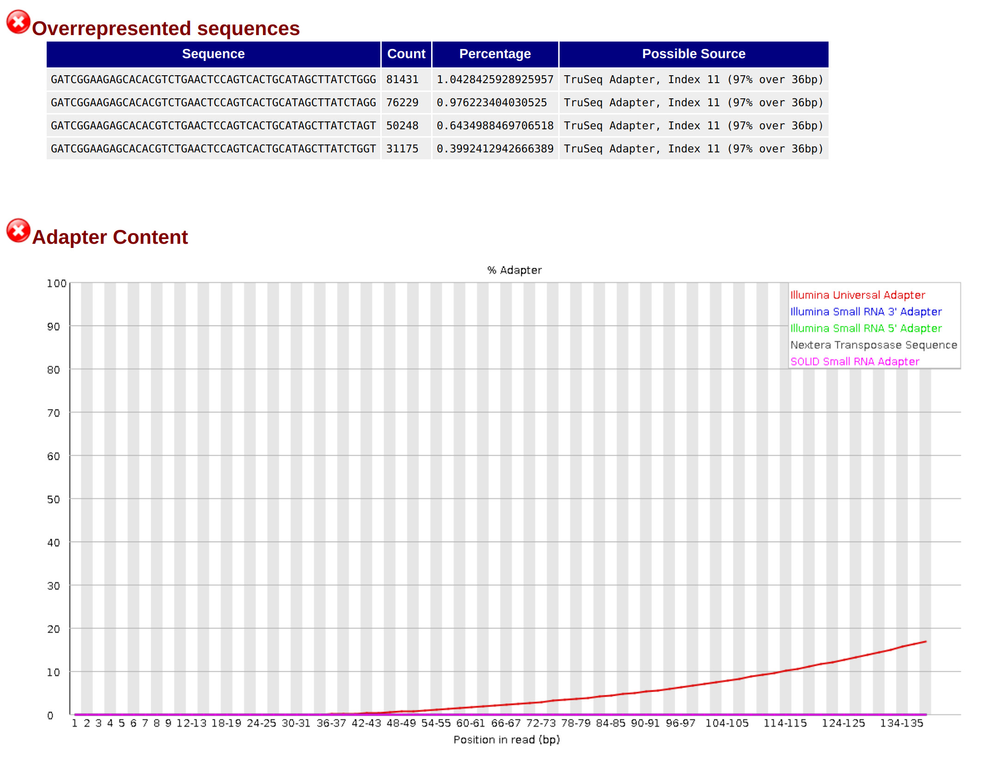
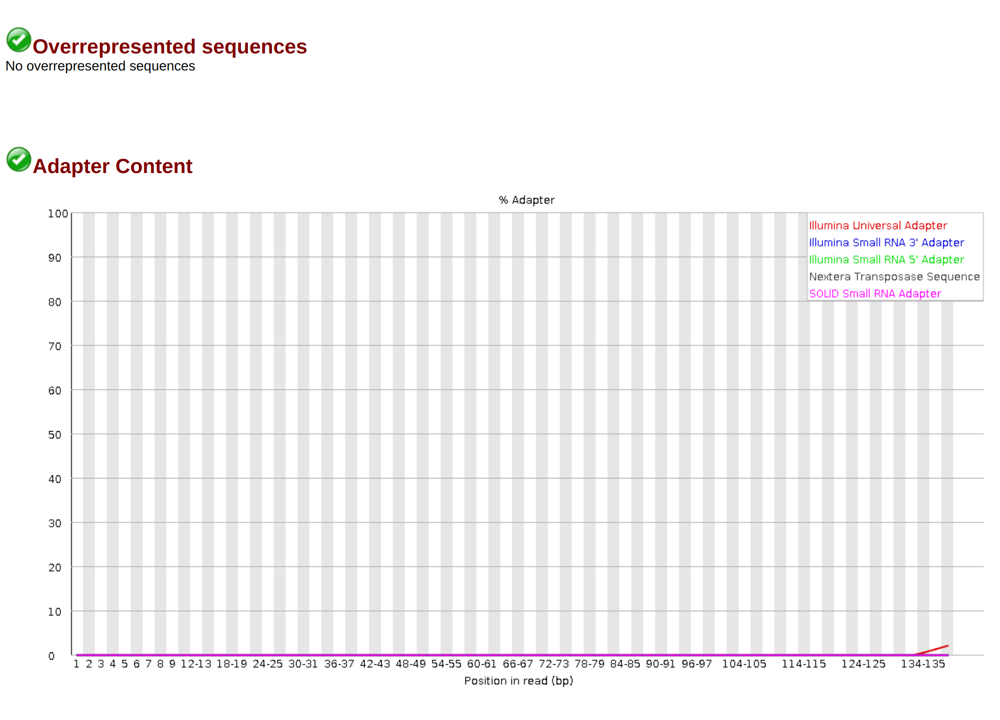
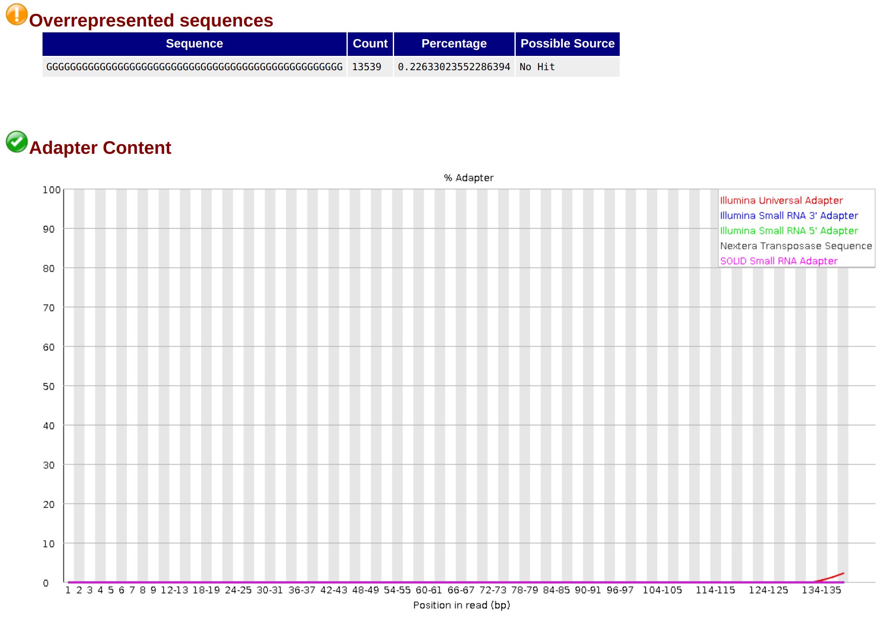

# MyGenome

## 1. Analyzing Sequence Quality
The Bm88315 sequence data was first analyzed using fastqc.
```
fastqc -t 2 Bm88315_1.fq Bm88315_2.fq -o pretrimmed_fastqc_output
```
**Fastqc Output Pages:**
* [Forward](https://wkamp.github.io/MyGenome/data/fastqc_output/pretrimmed_Bm88315_1_fastqc.html)
* [Backward](https://wkamp.github.io/MyGenome/data/fastqc_output/pretrimmed_Bm88315_2_fastqc.html)

The fastqc analysis shows that overall we have a pretty high quality sequence, however there's some adapter contamination and overrepresented sequences which need to be trimmed away.

|  | 
|:--:| 
| *Screenshot of the adapter contamination in the forward sequence.* |

## 2. Trimming the Sequence
The sequence was trimmed using Trimmomatic 0.38.
```
java -jar trimmomatic-0.38.jar PE -threads 2 -phred33 -trimlog Bm_errorlog.txt -summary trim_summary.txt Bm88315_1.fq Bm88315_2.fq Bm88315_1_paired.fq Bm88315_1_unpaired.fq Bm88315_2_paired.fq Bm88315_2_unpaired.fq ILLUMINACLIP:adaptors.fasta:2:30:10 SLIDINGWINDOW:20:20 MINLEN:150
```
**Trimmomatic Summary:**
* Input Read Pairs: 7808561
* Both Surviving Reads: 5981967
* Both Surviving Read Percent: 76.61%
* Forward Only Surviving Reads: 156422
* Forward Only Surviving Read Percent: 2.00%
* Reverse Only Surviving Reads: 1249998
* Reverse Only Surviving Read Percent: 16.01%
* Dropped Reads: 420174
* Dropped Read Percent: 5.38%

## 3. Analyzing Trimmed Sequence
```
fastqc -t 2 Bm88315_1_paired.fq Bm88315_1_unpaired.fq Bm88315_2_paired.fq Bm88315_2_unpaired.fq -o trimmed_fastqc_output
```
**Fastqc Output Pages:**
* [Forward Paired](https://wkamp.github.io/MyGenome/data/fastqc_output/trimmed_Bm88315_1_paired_fastqc.html)
* [Foward Unpaired](https://wkamp.github.io/MyGenome/data/fastqc_output/trimmed_Bm88315_1_unpaired_fastqc.html)
* [Backward Paired](https://wkamp.github.io/MyGenome/data/fastqc_output/trimmed_Bm88315_2_paired_fastqc.html)
* [Backward Unpaired](https://wkamp.github.io/MyGenome/data/fastqc_output/trimmed_Bm88315_2_unpaired_fastqc.html)

As you can see below, the trimming process managed to almost completely removed all adapter contamination. There is however an anomalous overrepresented sequence of all G's in the reverse read, but it shouldn't pose a problem for our genome assembly. 
|  | 
|:--:| 
| *Screenshot of the adapter contamination in the foward paired sequence.* |

|  | 
|:--:| 
| *Screenshot of the adapter contamination in the reverse paired sequence.* |

## 4. Counting Remaining Bases:
```
awk 'NR%4==2' Bm88315_1_paired.fq | grep -o "[ATCG]" | wc -l
awk 'NR%4==2' Bm88315_2_paired.fq | grep -o "[ATCG]" | wc -l
```
**Base Counts**
* Forward Paired: 897,156,993 
* Reverse Paired: 897,217,181
* Total: 1,794,374,174
