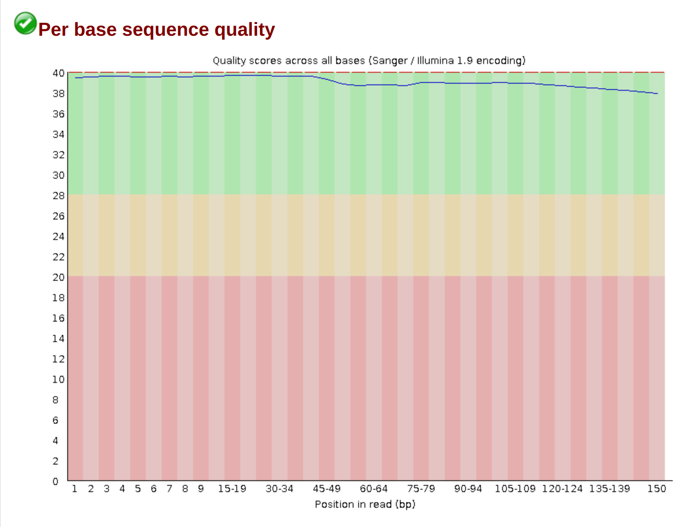
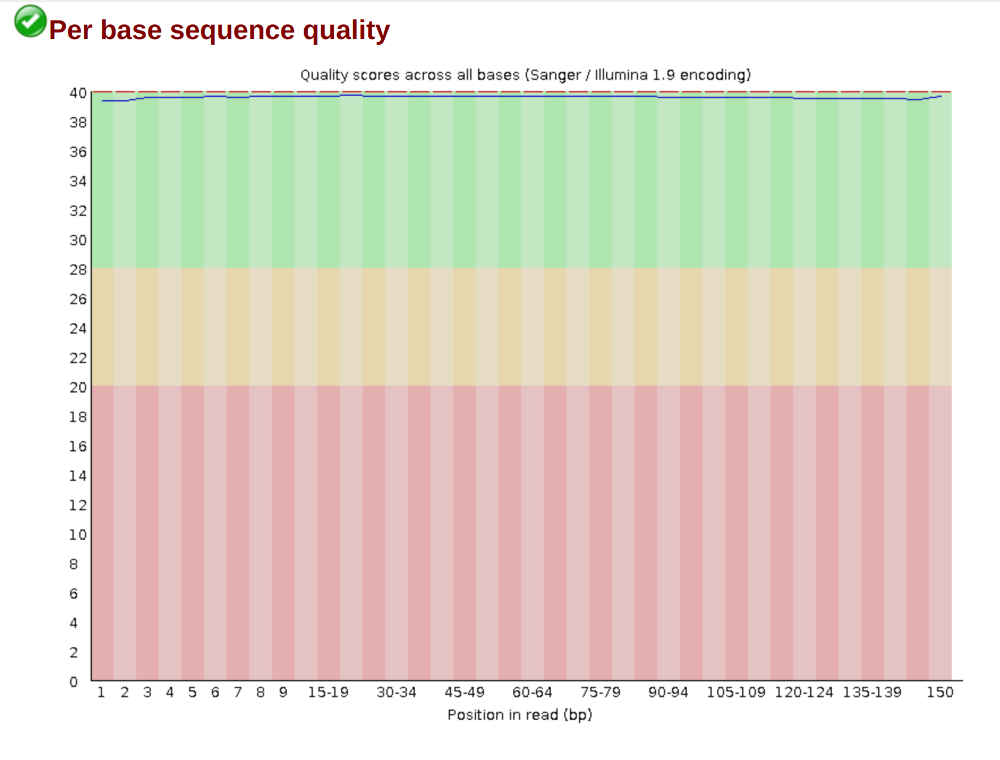

# MyGenome
## Pre-Processing
### 1. Analyzing Sequence Quality
The Bm88315 sequence data was first analyzed using fastqc.
```
fastqc -t 2 Bm88315_1.fq Bm88315_2.fq -o pretrimmed_fastqc_output
```
**Fastqc Output Pages:**
* [Forward](https://wkamp.github.io/MyGenome/data/fastqc_output/pretrimmed_Bm88315_1_fastqc.html)
* [Backward](https://wkamp.github.io/MyGenome/data/fastqc_output/pretrimmed_Bm88315_2_fastqc.html)

The fastqc analysis shows that overall we have a pretty high quality sequence, however there's some adapter contamination and overrepresented sequences which need to be trimmed away.
|  | 
|:--:| 
| *Screenshot of the per-base sequence quality in the foward sequence.* |

|  | 
|:--:| 
| *Screenshot of the adapter contamination in the forward sequence.* |

### 2. Trimming the Sequence
The sequence was trimmed using Trimmomatic 0.38.
```
java -jar trimmomatic-0.38.jar PE -threads 2 -phred33 -trimlog Bm_errorlog.txt -summary trim_summary.txt Bm88315_1.fq Bm88315_2.fq Bm88315_1_paired.fq Bm88315_1_unpaired.fq Bm88315_2_paired.fq Bm88315_2_unpaired.fq ILLUMINACLIP:adaptors.fasta:2:30:10 SLIDINGWINDOW:20:20 MINLEN:150
```
**Trimmomatic Summary:**
* Input Read Pairs: 7808561
* Both Surviving Reads: 5981967
* Both Surviving Read Percent: 76.61%
* Forward Only Surviving Reads: 156422
* Forward Only Surviving Read Percent: 2.00%
* Reverse Only Surviving Reads: 1249998
* Reverse Only Surviving Read Percent: 16.01%
* Dropped Reads: 420174
* Dropped Read Percent: 5.38%

### 3. Analyzing Trimmed Sequence
Once again we are using fastqc for analysis.
```
fastqc -t 2 Bm88315_1_paired.fq Bm88315_1_unpaired.fq Bm88315_2_paired.fq Bm88315_2_unpaired.fq -o trimmed_fastqc_output
```
**Fastqc Output Pages:**
* [Forward Paired](https://wkamp.github.io/MyGenome/data/fastqc_output/trimmed_Bm88315_1_paired_fastqc.html)
* [Foward Unpaired](https://wkamp.github.io/MyGenome/data/fastqc_output/trimmed_Bm88315_1_unpaired_fastqc.html)
* [Backward Paired](https://wkamp.github.io/MyGenome/data/fastqc_output/trimmed_Bm88315_2_paired_fastqc.html)
* [Backward Unpaired](https://wkamp.github.io/MyGenome/data/fastqc_output/trimmed_Bm88315_2_unpaired_fastqc.html)

As you can see below, the trimming process managed to almost completely remove all adapter contamination. There is however an anomalous overrepresented sequence of all G's in the reverse read, but it shouldn't pose a problem for our genome assembly. 
|  | 
|:--:| 
| *Screenshot of the per-base sequence quality in the reverse paired sequence.* |

|  | 
|:--:| 
| *Screenshot of the adapter contamination in the reverse paired sequence.* |

### 4. Counting Remaining Bases:
We want to know how many bases of the paired data survived the trimming process.
```
awk 'NR%4==2' Bm88315_1_paired.fq | grep -o "[ATCG]" | wc -l
awk 'NR%4==2' Bm88315_2_paired.fq | grep -o "[ATCG]" | wc -l
```
**Base Counts**
* Forward Paired: 897,156,993 
* Reverse Paired: 897,217,181
* Total: 1,794,374,174

## Genome Assembly
### 1. Initial Run
I'm using [Velvet](https://en.wikipedia.org/wiki/Velvet_assembler), more specifically [VelvetOptimiser](https://github.com/tseemann/VelvetOptimiser/tree/master) to assemble the genome. VelvetOptimiser uses Velvet to find the optimal kmer value; you just give it a range and step size.
```
sbatch velvetoptimiser_noclean.sh Bm88315 61 131 10
```
*kmer_start=61, kmer_end=131, step=10*

**Output:**
* Assembly score: 40737045
* Velveth version: 1.2.10
* Velvetg version: 1.2.10
* Readfile(s): -shortPaired -fastq -separate forward.fq reverse.fq
* Velveth parameter string: auto_data_101 101  -shortPaired -fastq -separate forward.fq reverse.fq
* Velvetg parameter string: auto_data_101  -clean no -clean yes -exp_cov 10 -cov_cutoff 2.88539630635769
* Velvet hash value: 101
* Roadmap file size: 667836908
* Total number of contigs: 8171
* n50: 23166
* length of longest contig: 150834
* Total bases in contigs: 42117401
* Number of contigs > 1k: 2924
* Total bases in contigs > 1k: 40737045
* Paired Library insert stats:
* Paired-end library 1 has length: 231, sample standard deviation: 103
* Paired-end library 1 has length: 232, sample standard deviation: 104

The optimal kmer value is the velvet hash value, so 101.

### 2. Optimal Run
In-order to get the most optimized kmer value we want to use a lower step size; the initial run will be used to narrow down the range. I want the previously found optimal kmer of 101 to be the middle of my narrowed down range, and I will half the total range. Previous range length was 70, 70/2 = 35, however 35/2 = 17.5, and we want to start on an odd number, so we will round up to 18. Final range is: [83, 119], step=2.

```
sbatch velvetoptimiser_noclean.sh Bm88315 83 119 2
```

**Output:**
* Final optimised assembly details:
* Assembly score: 40734870
* Velveth version: 1.2.10
* Velvetg version: 1.2.10
* Readfile(s): -shortPaired -fastq -separate forward.fq reverse.fq
* Velveth parameter string: auto_data_97 97  -shortPaired -fastq -separate forward.fq reverse.fq
* Velvetg parameter string: auto_data_97  -clean no -clean yes -exp_cov 11 -cov_cutoff 3.17393593699346
* Velvet hash value: 97
* Roadmap file size: 680108857
* Total number of contigs: 4175
* n50: 29272
* length of longest contig: 151383
* Total bases in contigs: 41374414
* Number of contigs > 1k: 2503
* Total bases in contigs > 1k: 40734870
* Paired Library insert stats:
* Paired-end library 1 has length: 231, sample standard deviation: 103
* Paired-end library 1 has length: 232, sample standard deviation: 104

The most optimal kmer is 97.
